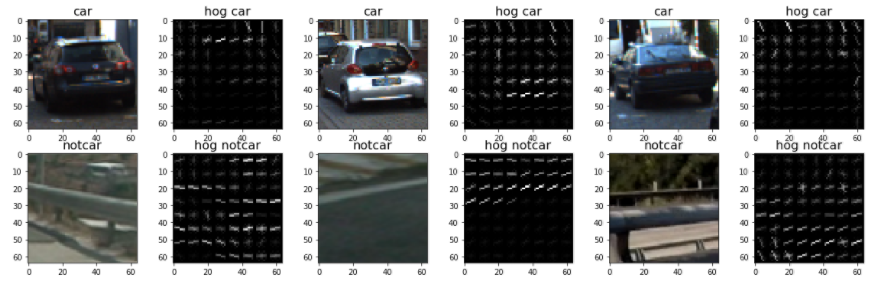

##Writeup Template
###You can use this file as a template for your writeup if you want to submit it as a markdown file, but feel free to use some other method and submit a pdf if you prefer.

---

**Vehicle Detection Project**

The goals / steps of this project are the following:

* Perform a Histogram of Oriented Gradients (HOG) feature extraction on a labeled training set of images and train a Linear SVM classifier
* Optionally, you can also apply a color transform and append binned color features, as well as histograms of color, to your HOG feature vector. 
* Note: for those first two steps don't forget to normalize your features and randomize a selection for training and testing.
* Implement a sliding-window technique and use your trained classifier to search for vehicles in images.
* Run your pipeline on a video stream (start with the test_video.mp4 and later implement on full project_video.mp4) and create a heat map of recurring detections frame by frame to reject outliers and follow detected vehicles.
* Estimate a bounding box for vehicles detected.

[//]: # (Image References)
[image1]: ./examples/car_not_car.png
[image2]: ./examples/HOG_example.jpg
[image3]: ./examples/sliding_windows.jpg
[image4]: ./examples/sliding_window.jpg
[image5]: ./examples/bboxes_and_heat.png
[image6]: ./examples/labels_map.png
[image7]: ./examples/output_bboxes.png
[video1]: ./project_video.mp4

## [Rubric](https://review.udacity.com/#!/rubrics/513/view) Points
### Here I will consider the rubric points individually and describe how I addressed each point in my implementation.  

---
### Writeup / README

#### 1. Provide a Writeup / README that includes all the rubric points and how you addressed each one.  You can submit your writeup as markdown or pdf.  [Here](https://github.com/udacity/CarND-Vehicle-Detection/blob/master/writeup_template.md) is a template writeup for this project you can use as a guide and a starting point.  

You're reading it!

### Histogram of Oriented Gradients (HOG)

#### 1. Explain how (and identify where in your code) you extracted HOG features from the training images.

The code for this step is contained in the "Utility functions" section of the Jupyter notebook.

The `get_hog_features` method - which is heavily based on what has been done in the course lessons - does all the heavy lifting. One has to provide, the color channel of an image `img`, the number of orientation bins `orient`, the number of pixels per cell `pix_per_cell` and the number of cells per block `cell_per_block`. I use the OpenCV hog feature extraction instead of the one provided with sklearn, because the OpenCV implementation is _much_ faster.

This functionality is then used in the "Train the classifier" section of the Jupyter notebook. There, the `vehicle` and `non-vehicle` images are loaded, and the function `extract_features` is used to extract HOG as well as spatial and color histogram features.

Here are a few examples of the `vehicle` and `non-vehicle` classes:


I then explored different color spaces and different `skimage.hog()` parameters (`orientations`, `pixels_per_cell`, and `cells_per_block`).  I grabbed random images from each of the two classes and displayed them to get a feel for what the `skimage.hog()` output looks like.

Here are a few examples using the `YUV` color space and HOG parameters of `orientations=9`, `pixels_per_cell=(8, 8)` and `cells_per_block=(2, 2)`:




#### 2. Explain how you settled on your final choice of HOG parameters.

I did an extensive grid search using different hog parameters with the SVC classifier explained in the next section. To this end, I created the `VehicleClassifierConfiguration` class which combines all the necessary parameters and allows easy invocation and comparison of different configurations. The best results on the test set were obtained in the configuration

````
VehicleClassifierConfiguration(color_space='HSV', orient = 11, hog_channel='ALL', pix_per_cell = 8, cell_per_block = 2)
````

However, this configuration produced too many false positives later whence I settled with

````
VehicleClassifierConfiguration(color_space='YCrCb', orient = 9, hog_channel='ALL', pix_per_cell = 8, cell_per_block = 2)
````

| color_space | channel | orient | time to train | accuracy |
| ----------- | ------- | ------ | ------------- | -------- |
| RGB | 0 | 7 | 6.71 | 0.9696 |
| RGB | 0 | 9 | 6.67 | 0.9761 |
| RGB | 0 | 11 | 7.97 | 0.9704 |
| RGB | 1 | 7 | 5.71 | 0.9733 |
| RGB | 1 | 9 | 6.81 | 0.9716 |
| RGB | 1 | 11 | 7.9 | 0.9744 |
| RGB | 2 | 7 | 5.66 | 0.9688 |
| RGB | 2 | 9 | 6.51 | 0.9724 |
| RGB | 2 | 11 | 7.27 | 0.9769 |
| RGB | ALL | 7 | 12.47 | 0.9758 |
| RGB | ALL | 9 | 15.62 | 0.978 |
| RGB | ALL | 11 | 19.81 | 0.9803 |
| YCrCb | 0 | 7 | 4.94 | 0.9741 |
| YCrCb | 0 | 9 | 5.83 | 0.9772 |
| YCrCb | 0 | 11 | 6.76 | 0.9758 |
| YCrCb | 1 | 7 | 6.02 | 0.9583 |
| YCrCb | 1 | 9 | 8.09 | 0.9533 |
| YCrCb | 1 | 11 | 8.57 | 0.9583 |
| YCrCb | 2 | 7 | 6.68 | 0.9519 |
| YCrCb | 2 | 9 | 8.15 | 0.9448 |
| YCrCb | 2 | 11 | 8.83 | 0.9555 |
| YCrCb | ALL | 7 | 8.93 | 0.9887 |
| YCrCb | ALL | 9 | 11.23 | 0.989 |
| YCrCb | ALL | 11 | 14.1 | 0.9916 |
| LUV | 0 | 7 | 8.69 | 0.9347 |
| LUV | 0 | 9 | 10.37 | 0.9265 |
| LUV | 0 | 11 | 11.53 | 0.9215 |
| LUV | 1 | 7 | 6.9 | 0.949 |
| LUV | 1 | 9 | 8.67 | 0.944 |
| LUV | 1 | 11 | 10.35 | 0.9389 |
| LUV | 2 | 7 | 7.87 | 0.9372 |
| LUV | 2 | 9 | 9.75 | 0.9406 |
| LUV | 2 | 11 | 11.11 | 0.9336 |
| LUV | ALL | 7 | 21.01 | 0.9398 |
| LUV | ALL | 9 | 26.83 | 0.942 |
| LUV | ALL | 11 | 34.09 | 0.9431 |
| HSV | 0 | 7 | 7.22 | 0.9431 |
| HSV | 0 | 9 | 8.43 | 0.9423 |
| HSV | 0 | 11 | 9.87 | 0.9496 |
| HSV | 1 | 7 | 6.11 | 0.9583 |
| HSV | 1 | 9 | 7.14 | 0.9555 |
| HSV | 1 | 11 | 8.41 | 0.9631 |
| HSV | 2 | 7 | 4.62 | 0.9792 |
| HSV | 2 | 9 | 5.41 | 0.9789 |
| HSV | 2 | 11 | 6.35 | 0.9775 |
| HSV | ALL | 7 | 2.86 | 0.9913 |
| HSV | ALL | 9 | 12.46 | 0.9916 |
| HSV | ALL | 11 | 2.82 | 0.9935 |
| LUV | 0 | 7 | 8.38 | 0.9192 |
| LUV | 0 | 9 | 10.08 | 0.9234 |
| LUV | 0 | 11 | 11.88 | 0.9316 |
| LUV | 1 | 7 | 6.85 | 0.9488 |
| LUV | 1 | 9 | 8.66 | 0.9457 |
| LUV | 1 | 11 | 9.98 | 0.9457 |
| LUV | 2 | 7 | 7.4 | 0.9276 |
| LUV | 2 | 9 | 9.05 | 0.9333 |
| LUV | 2 | 11 | 10.93 | 0.9398 |
| LUV | ALL | 7 | 20.19 | 0.9448 |
| LUV | ALL | 9 | 26.56 | 0.9381 |
| LUV | ALL | 11 | 33.57 | 0.9423 |
| HLS | 0 | 7 | 6.83 | 0.9423 |
| HLS | 0 | 9 | 8.17 | 0.9465 |
| HLS | 0 | 11 | 9.65 | 0.9488 |
| HLS | 1 | 7 | 4.77 | 0.9806 |
| HLS | 1 | 9 | 5.56 | 0.9823 |
| HLS | 1 | 11 | 6.63 | 0.9803 |
| HLS | 2 | 7 | 6.64 | 0.9482 |
| HLS | 2 | 9 | 8.03 | 0.9521 |
| HLS | 2 | 11 | 9.37 | 0.9572 |
| HLS | ALL | 7 | 9.12 | 0.9899 |
| HLS | ALL | 9 | 4.32 | 0.991 |
| HLS | ALL | 11 | 3.18 | 0.9907 |
| YUV | 0 | 7 | 4.78 | 0.9733 |
| YUV | 0 | 9 | 5.7 | 0.973 |
| YUV | 0 | 11 | 6.73 | 0.9789 |
| YUV | 1 | 7 | 6.46 | 0.9474 |
| YUV | 1 | 9 | 7.95 | 0.9474 |
| YUV | 1 | 11 | 8.7 | 0.9544 |
| YUV | 2 | 7 | 6.17 | 0.9538 |
| YUV | 2 | 9 | 7.49 | 0.9578 |
| YUV | 2 | 11 | 8.24 | 0.9595 |
| YUV | ALL | 7 | 9.15 | 0.9879 |
| YUV | ALL | 9 | 11.53 | 0.9879 |
| YUV | ALL | 11 | 9.22 | 0.9913 |

#### 3. Describe how (and identify where in your code) you trained a classifier using your selected HOG features (and color features if you used them).

I trained the linear svm classifier with `C` values `1`, `10`, `100` and loss functions `squared_hinge` and `hinge`. The optimal result was obtained with `C=10` and `loss='hinge'` with a test set accuracy of 0.989.

Here is the confusion matrix for the test set.


### Sliding Window Search

#### 1. Describe how (and identify where in your code) you implemented a sliding window search.  How did you decide what scales to search and how much to overlap windows?

My general strategy was to optimize the true positive case and filter out false positives later.

I evaluated window sizes of 16x16, 24x24, 32x32, 64x64, 80x80, 96x96, 102x102, 128x128. Only the last five effected in usable matches.
Further, I checked overlaps of 50% and 75%. Having more overlap resulted in better matches, thus I deced to go with 75%.
Inspecting the test images shows that it is enough to focus on the `y`-region `[400, 600]`. In fact, for the smaller windows one can concentrate on even smaller regions.

Here is a list of all window sizes used

| Window Size | X-Range | Y-Range    | Overlap      |
| ----------- | ------- | ---------- | ------------ |
| 64x64       | ALL     | [400, 500] | (0.75, 0.75) |
| 80x80       | ALL     | [400, 550] | (0.75, 0.75) |
| 96x96       | ALL     | [400, 550] | (0.75, 0.75) |
| 112x112     | ALL     | [400, 550] | (0.75, 0.75) |
| 128x128     | ALL     | [400, 600] | (0.75, 0.75) |
    
The windows are created using the `create_window` function in the "Sliding Windows" section of the Jupyter Notebook.

Here is a visualization of all five configurations


#### 2. Show some examples of test images to demonstrate how your pipeline is working.  What did you do to optimize the performance of your classifier?

Ultimately I searched on five scales using HSV 3-channel HOG features plus spatially binned color and histograms of color in the feature vector.  Here are some example images:


---

### Video Implementation

#### 1. Provide a link to your final video output.  Your pipeline should perform reasonably well on the entire project video (somewhat wobbly or unstable bounding boxes are ok as long as you are identifying the vehicles most of the time with minimal false positives.)

Here's a [link to my video result](./project_video_out.mp4)


#### 2. Describe how (and identify where in your code) you implemented some kind of filter for false positives and some method for combining overlapping bounding boxes.

For each frame I do a sliding window search. If one of the windows has a positive detection, it is scaled by a factor of 1.5 and recorded. From all recorded windows I create a heatmap and this heatmap is smoothened exponentially in each time step with `alpha = 0.3`. The smoothened heat map is then thresholded and `scipy.ndimage.measurements.label()` is used to to identify individual blobs in the heatmap. Each blob is assumed to correspond to a vehicle detection.  I constructed bounding boxes to cover the area of each blob detected -- see the `pipeline` function.


A list of tracks (bounding boxes with properties) is kept in memory. After a frame has been processed and the bounding boxes have been created, the list of tracks is searched for best (close) matches and the match counter of the track is incremented and its bounding box is updated. After three successive matches, a track is activated and designated by a coloured bounding box in the image. If a track is lost for five frames, it is no longer shown.

Here is an example showing two tracks, also the smoothened heat map and the bounding boxes derived from the heat map are shown.


---

### Discussion

#### 1. Briefly discuss any problems / issues you faced in your implementation of this project.  Where will your pipeline likely fail?  What could you do to make it more robust?

- The classifier has several false positives. One could record them and use them to train the classifier on additional "non-vehicle" samples.
- The classifier uses only hog features from one color space, while several have been identified to work well. One could build a feature vector from hog features extracted from several distinct color spaces to improve the classifier.
- The classifier uses a "classic" approach using SVMs. It would be interesting to see how a CNN classifier would compare here.
- The tracking is very basic and does not predict the motion of the track from frame to frame using e.g. a Kalman filter. This could be used to improve tracks in situations with partial occlusion.
- The algorithm is very computational intensive. It took almost 10mins to encode a 1min video on my machine. Parallelization could be used in several places to speed things up. This is crucial since the detection has to work in (almost) real time.
- It would be very interesting to investigate an end-to-end approach for vehicle detection - any hints?